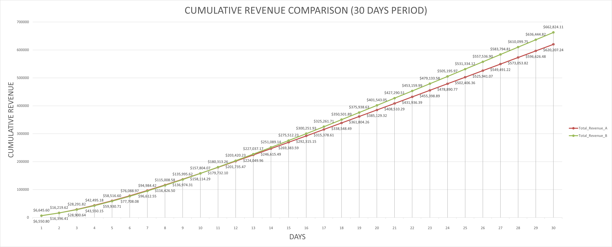
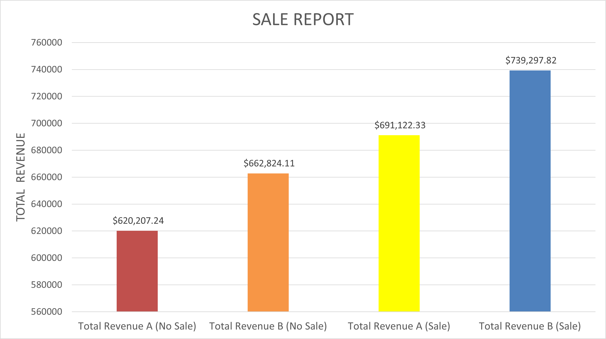

# Mobile Game A/B Testing & Retention Analysis Case Study 🎮

## 📌 Executive Summary (The Verdict)
**Task 1-a Winner:** **Variant B**

My simulation confirms **Variant B** as the superior choice. The analysis relies on three key visual indicators:

### 1. User Retention (DAU) Trend
While Variant A has a higher initial start (Day 1), **Variant B** demonstrates superior "long-tail" retention. As shown in the graph below, Variant B's active user count overtakes Variant A after the first week and maintains the lead.


### 2. Cumulative Revenue Growth
This retention advantage directly translates into monetization. Variant B generates significantly higher total revenue by Day 30, proving that keeping players in the game longer is more profitable than a high initial purchase rate.



### 3. Impact of Discount Strategy (Case D)
I also modeled the impact of a 10-day sale event (Case D) compared to the standard pricing (Case C). The bar chart below highlights a significant revenue uplift when the discount strategy is applied, confirming high price elasticity.




---

## 📖 Project Overview
This repository contains the solution for the Data Analyst Case Study. The goal is to analyze two game variants (A vs. B) to determine the best User Acquisition strategy using mathematical modeling, simulation, and exploratory data analysis.

The project follows a modular software engineering approach, separating configuration, mathematical models, and simulation logic to ensure **clean, reusable, and reproducible code.**

## 🛠️ Methodology & Approach

### 1. Mathematical Modeling (Python)
Instead of relying on simple averages, I utilized **Curve Fitting (Least Squares Method, never though would be useful when I had to calculate by hand in Robotics class :])** to model user retention.
* **Formula:** $Retention(x) = a \cdot e^{-b(x-1)}$
* **Library:** `scipy.optimize.curve_fit`
* **Reasoning:** This allows for predicting DAU and Revenue for future days (e.g., Day 30) where actual data was not provided.

### 2. Simulation Engine
I built a custom simulation engine (`src/analysis.py`) that calculates:
* **Daily Active Users (DAU):** Using a convolution-like approach to sum up remaining users from all previous cohorts.
* **Revenue:** Aggregating In-App Purchases (IAP) and Ad Revenue based on ARPPU and eCPM metrics.

### 3. Exploratory Data Analysis (SQL)
Beyond the simulation, I used SQL to perform EDA on the provided dataset to uncover trends regarding:
* First-day engagement impact on LTV.
* Skill-based churn (Win/Loss rates).
* Country-tier performance segmentation.

---

## Assumptions Made
To conduct this simulation, the following assumptions were made based on the provided data:

1.  **Retention Decay:** User retention follows an exponential decay pattern perfectly fitting the derived parameters ($a$ and $b$).
2.  **Constant Metrics:** ARPPU (Average Revenue Per Paying User, 10.0 Dollars), Purchase Rates, and eCPM remain constant throughout the simulation period (unless a specific event, like a Sale, is triggered).
3.  **Install Consistency:** Daily installs are constant (20,000) for Cases A, B, C, and D. Dynamic installs are only applied in Case E.
4.  **Ad Impressions:** Ad impressions per DAU remain stable as user tenure increases.

---

## 📂 Repository Structure

The project is structured to be modular and scalable:

```bash
├── src/
│   ├── config.py       # Centralized configuration (Metrics, Constants)
│   ├── models.py       # Mathematical formulas & Curve fitting logic
│   └── analysis.py     # Simulation engine & Revenue calculations
├── main.py             # Main entry point to run simulations
├── eda_queries.sql     # SQL scripts for Exploratory Data Analysis
├── requirements.txt    # Python dependencies
└── README.md           # Project documentation
